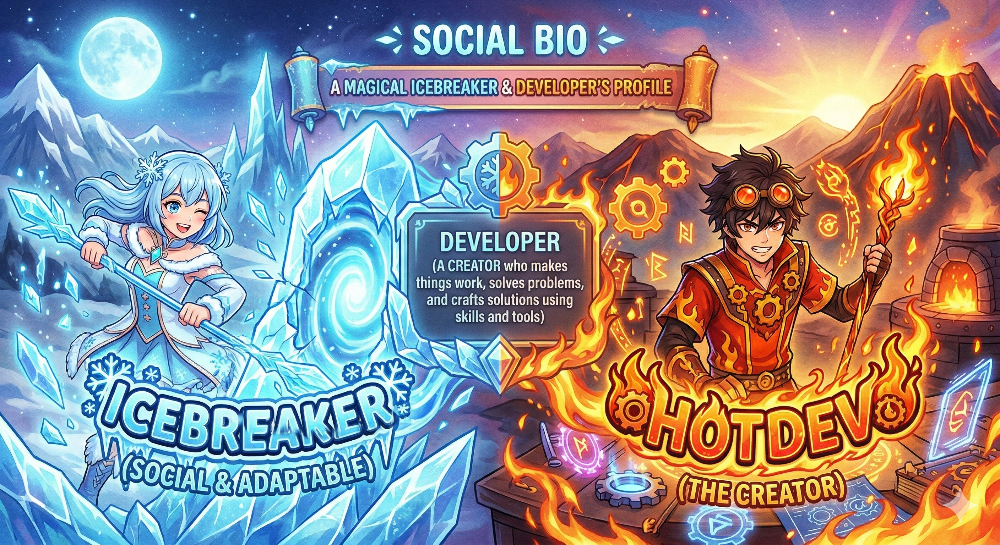

<div align="center">



<br/>

# HOTDEV

### AI Full-Stack Engineer · Mobile · Real-Time Systems · Cloud

**Building reliable, production-ready software across AI, web, mobile, and infrastructure.**

<p>
  <a href="https://github.com/ICEBREAKER-HOTDEV?tab=repositories">
    
  </a>
  <a href="https://github.com/ICEBREAKER-HOTDEV?tab=followers">
    
  </a>
</p>

</div>

---

## About Me

I build software products that combine **strong engineering, thoughtful UX, and practical AI**.

My work spans AI-powered SaaS, mobile applications, real-time voice/video systems, computer vision, backend platforms, automation, and cloud infrastructure.

I focus on software that works beyond the demo:

- Clean and maintainable architecture
- Secure APIs and data flows
- Fast, responsive product experiences
- Reliable third-party integrations
- Production-ready deployment and monitoring
- Systems designed to scale without unnecessary complexity

---

## What I Build

<table>
<tr>
<td width="50%" valign="top">

### AI & Intelligent Systems

- AI agents and assistants
- RAG applications
- Voice AI and conversational systems
- Computer vision
- LLM/API integrations
- AI workflow automation
- Structured generation pipelines

</td>
<td width="50%" valign="top">

### Web & SaaS Products

- SaaS platforms
- Admin dashboards
- Marketplaces
- Client portals
- Authentication and billing
- Real-time applications
- API-driven products

</td>
</tr>

<tr>
<td width="50%" valign="top">

### Mobile & Cross-Platform

- Flutter applications
- React Native applications
- Native iOS with Swift / SwiftUI
- Native Android with Kotlin
- Mobile-first product experiences
- Offline and background workflows

</td>
<td width="50%" valign="top">

### Real-Time, Cloud & DevOps

- WebRTC and streaming
- FFmpeg media pipelines
- Event-driven backends
- AWS infrastructure
- Docker and Kubernetes
- Terraform
- CI/CD and production deployment

</td>
</tr>
</table>

---

## Tech Stack

<div align="center">

### Frontend & Mobile


<br/><br/>

### Backend & Data


<br/><br/>

### Cloud & Infrastructure


<br/><br/>

### 3D, Game & Engineering Tools


</div>

---

## Featured Projects

<table>
<tr>
<td width="50%" valign="top">

### 🎙️ AI Voice Agent Interview

Real-time AI interview experience combining voice interaction, transcription, AI feedback, authentication, and structured workflows.

**Core stack**

`Next.js` `TypeScript` `Firebase` `Vapi` `Deepgram`

<br/>

<a href="https://github.com/ICEBREAKER-HOTDEV/Voice_Agent_Interview">
  <b>View Repository →</b>
</a>

</td>
<td width="50%" valign="top">

### 🏥 MedB

Cross-platform healthcare application with scalable Flutter architecture, secure authentication, API integration, and structured state management.

**Core stack**

`Flutter` `Dart` `Bloc/Cubit` `Dio`

<br/>

<a href="https://github.com/ICEBREAKER-HOTDEV/MedB">
  <b>View Repository →</b>
</a>

</td>
</tr>

<tr>
<td width="50%" valign="top">

### 🥗 Nutri

Mobile nutrition product combining application development with computer vision, image processing, and supporting backend services.

**Core stack**

`Flutter` `Python` `OpenCV` `Node.js`

<br/>

<a href="https://github.com/ICEBREAKER-HOTDEV/Nutri">
  <b>View Repository →</b>
</a>

</td>
<td width="50%" valign="top">

### 🎬 CompressO

Cross-platform media-processing application focused on efficient video compression and practical FFmpeg-powered workflows.

**Core stack**

`TypeScript` `FFmpeg` `Desktop`

<br/>

<a href="https://github.com/ICEBREAKER-HOTDEV/CompressO">
  <b>View Repository →</b>
</a>

</td>
</tr>
</table>

---

## Engineering Focus

```text
AI / LLM         → Agents, RAG, Voice AI, Vision, Automation
Web              → SaaS, Dashboards, Marketplaces, Real-Time Apps
Mobile           → Flutter, React Native, Swift, Kotlin
Real-Time        → WebRTC, RTMP/HLS, FFmpeg, Voice/Video Pipelines
Backend          → APIs, Event-Driven Workflows, Databases
Cloud / DevOps   → AWS, Docker, Kubernetes, Terraform, CI/CD
3D / Interactive → Three.js, WebGL, WebXR
Game             → Unity, Godot
